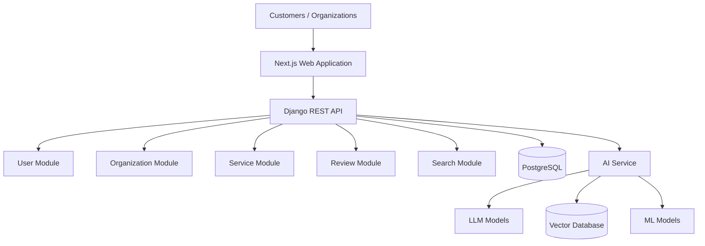

# Software Architecture Document

Version: 1.0

---

# Table of Contents

1. Architecture Goal
2. Architecture Principles
3. System Overview
4. Architecture Approach
5. High-Level Architecture
6. Application Components
7. Backend Architecture
8. Frontend Architecture
9. AI Architecture
10. Data Architecture
11. Communication Flow
12. Scalability Strategy
13. Future Microservice Migration

---

# 1. Architecture Goal

Design a scalable AI-powered service intelligence platform that can start as an MVP and grow into a large multi-industry technology platform.

The architecture must support:

- Millions of users
- Thousands of organizations
- AI-powered features
- Large data processing
- Multiple industries
- Future international expansion

---

# 2. Architecture Principles

## Simplicity First

Start with simple architecture that can grow.

---

## Modular Design

Each business domain should be separated.

---

## API First

Frontend, mobile, and external systems communicate through APIs.

---

## Security by Design

Security is included from the beginning.

---

## AI Ready

The system must support future AI capabilities.

---

# 3. System Overview

The platform contains:

```
Customer Application

        |

Frontend

        |

Backend API

        |

Business Modules

        |

Database


+

AI Services


+

Data Pipeline
```

---

# 4. Architecture Approach

## Initial Architecture

# Modular Monolith + AI Service


The main application is one backend with separated modules.

Example:

```
Backend

├── Users
├── Organizations
├── Services
├── Reviews
├── Search
├── Analytics
└── Payments
```

AI runs separately:

```
AI Engine

├── Recommendation
├── Sentiment Analysis
├── Summarization
└── Semantic Search
```

---

# 5. High-Level Architecture



---

# 6. Application Components

## Frontend

Technology:

- Next.js
- TypeScript
- Tailwind CSS
- React Query
- Zustand


Responsibilities:

- User interface
- Search experience
- Organization pages
- Dashboard
- User interactions

---

# Backend API

Technology:

- Python
- Django
- Django REST Framework


Responsibilities:

- Business logic
- Authentication
- Permissions
- Data management
- API services

---

# AI Service

Technology:

- Python
- FastAPI
- PyTorch
- LangChain


Responsibilities:

- AI search
- Recommendations
- Sentiment analysis
- Summaries

---

# Database

Technology:

- PostgreSQL


Stores:

- Users
- Organizations
- Services
- Reviews
- Ratings
- Transactions

---

# Search Engine

Technology:

Initial:

- PostgreSQL Search

Future:

- Elasticsearch
- Vector Database


Purpose:

- Fast search
- Semantic search
- Filtering

---

# 7. Backend Architecture

The backend follows:

## Clean Architecture


```
API Layer

↓

Service Layer

↓

Repository Layer

↓

Database
```


---

## Backend Modules


```
backend/apps/

├── users

├── organizations

├── services

├── reviews

├── search

├── recommendations

├── analytics

├── subscriptions

└── verification
```

---

# Module Responsibility


## Users

Handles:

- Registration
- Authentication
- Roles
- Permissions


---

## Organizations

Handles:

- Company profiles
- Verification
- Business information


---

## Services

Handles:

- Service listings
- Categories
- Pricing


---

## Reviews

Handles:

- Ratings
- Feedback
- Moderation


---

## Search

Handles:

- Search queries
- Filtering
- Ranking


---

## Analytics

Handles:

- Reports
- Metrics
- Insights


---

# 8. Frontend Architecture


Structure:

```
frontend/

├── app

├── components

├── features

├── services

├── hooks

├── store

├── types

└── utils
```

---

# Main Features


```
features/

├── authentication

├── organization

├── search

├── review

├── comparison

├── dashboard
```

---

# 9. AI Architecture


AI components:

```
User Query

↓

AI Processing

↓

Search / Recommendation Model

↓

Relevant Data

↓

AI Response
```


---

# AI Features


## Semantic Search

Understands user intent.

Example:

"Affordable family hotel near airport"

instead of only:

"hotel"


---

## Recommendation Engine

Uses:

- User preferences
- Location
- Budget
- Previous behavior
- Ratings


---

## Sentiment Analysis

Analyzes reviews:

Example:

Input:

"Great service but parking is difficult"

Output:

Positive:

Service quality

Negative:

Parking

---

## AI Summary

Converts many reviews into:

```
Strengths:
- Good customer service
- Clean environment

Weakness:
- High waiting time
```

---

# 10. Data Architecture


Data flow:


```
Users

↓

Application Database

↓

Data Processing

↓

AI Models

↓

Insights

↓

Users and Organizations
```

---

# 11. Communication Flow


Customer search example:


```
User

↓

Frontend

↓

Backend API

↓

Search Module

↓

Database

↓

AI Recommendation Service

↓

Response

↓

Frontend Display
```

---

# 12. Scalability Strategy


## Stage 1

MVP

Architecture:

```
Modular Monolith

+

AI Service
```


---

## Stage 2

Growth


Separate:

- Search Service
- Analytics Service
- Recommendation Service


---

## Stage 3

Large Scale


Move to:

- Microservices
- Kubernetes
- Distributed systems

---

# 13. Future Microservice Migration


Possible services:


```
User Service

Organization Service

Review Service

Search Service

Recommendation Service

Analytics Service

Payment Service
```


Migration approach:

```
Extract one module at a time.

Do not rewrite the entire system.
```

---

# Final Architecture Decision


The project will start with:


```
Frontend:

Next.js


Backend:

Django REST Framework


Database:

PostgreSQL


Cache:

Redis


AI:

FastAPI + ML Models


Infrastructure:

Docker + Cloud
```


This architecture provides fast development while keeping a clear path to enterprise scale.

---

End of Document