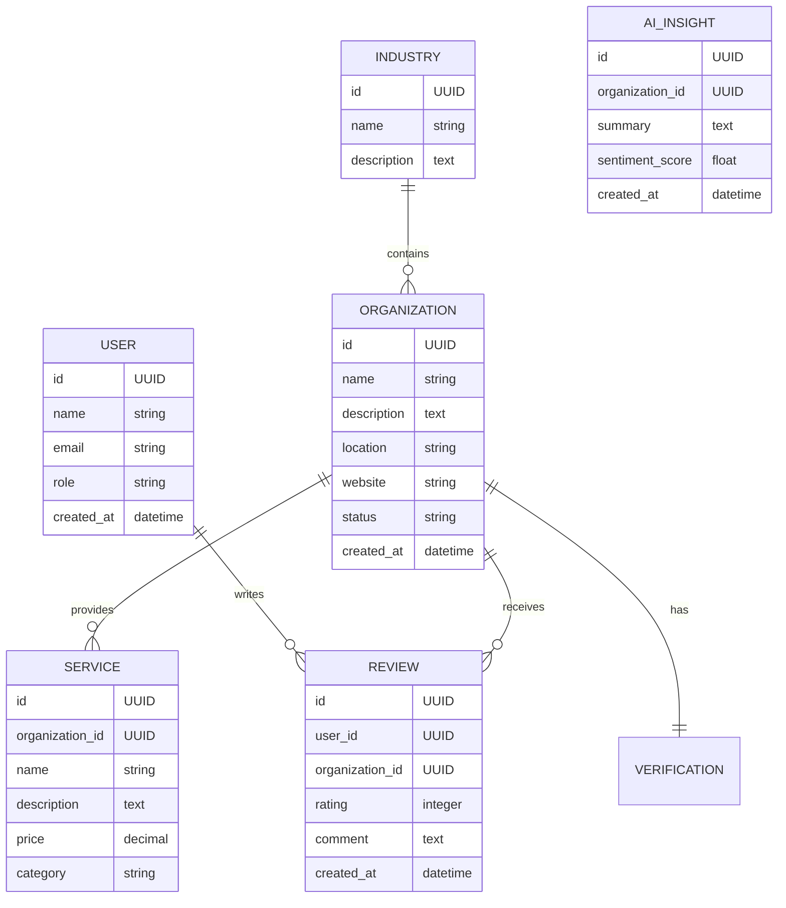

# Database Design Document

Version: 1.0

---

# Table of Contents

1. Database Goal
2. Database Technology
3. Data Design Principles
4. Main Entities
5. Entity Relationship Diagram
6. Core Tables
7. Relationships
8. AI Data Storage
9. Data Security
10. Future Scaling

---

# 1. Database Goal

Design a reliable data structure that supports:

- Organization information
- Service information
- Customer interactions
- Reviews and ratings
- AI processing
- Analytics
- Business intelligence

The database should support multiple industries and future expansion.

---

# 2. Database Technology

## Primary Database

PostgreSQL


Used for:

- Transactional data
- User information
- Organizations
- Services
- Reviews


---

## Cache Database

Redis


Used for:

- Sessions
- Frequently accessed data
- Background jobs


---

## Vector Database (Future)

Used for:

- AI semantic search
- Document embeddings
- Recommendation system


Examples:

- pgvector
- Pinecone
- Weaviate

---

# 3. Data Design Principles

## Data Integrity

Data must be accurate and consistent.

---

## Normalization

Avoid duplicate information.

---

## Scalability

Support increasing users and organizations.

---

## Security

Protect personal and business information.

---

# 4. Main Entities


Core entities:


```
User

Organization

Industry

Service

Category

Review

Rating

Verification

Recommendation

Comparison

Subscription

Analytics

AI Insight
```

---

# 5. Entity Relationship Diagram




---

# 6. Core Tables


# User Table


Purpose:

Stores platform users.


Fields:


| Field | Type |
|-|-|
| id | UUID |
| name | String |
| email | String |
| password_hash | String |
| role | Enum |
| status | Boolean |
| created_at | DateTime |


Roles:


```
Customer

Organization Owner

Admin

Super Admin
```

---

# Organization Table


Purpose:

Stores registered service providers.


Fields:


| Field | Type |
|-|-|
| id | UUID |
| name | String |
| description | Text |
| industry_id | UUID |
| location | String |
| phone | String |
| website | String |
| verification_status | Enum |
| created_at | DateTime |


---

# Industry Table


Purpose:

Categorizes organizations.


Examples:


```
Healthcare

Hospitality

Technology

Education

Finance
```

---

# Service Table


Purpose:

Stores services offered by organizations.


Fields:


| Field | Type |
|-|-|
| id | UUID |
| organization_id | UUID |
| name | String |
| description | Text |
| price | Decimal |
| status | Boolean |


---

# Review Table


Purpose:

Stores customer feedback.


Fields:


| Field | Type |
|-|-|
| id | UUID |
| user_id | UUID |
| organization_id | UUID |
| rating | Integer |
| comment | Text |
| verified | Boolean |
| created_at | DateTime |


---

# Rating Table


Purpose:

Stores scoring information.


Possible ratings:


```
Quality

Price

Customer Service

Speed

Overall Experience
```

---

# Verification Table


Purpose:

Confirms organization authenticity.


Fields:


| Field | Type |
|-|-|
| id | UUID |
| organization_id | UUID |
| document | File |
| status | Enum |
| verified_at | DateTime |


---

# Recommendation Table


Purpose:

Stores AI recommendations.


Fields:


| Field | Type |
|-|-|
| id | UUID |
| user_id | UUID |
| organization_id | UUID |
| score | Float |
| reason | Text |


---

# Comparison Table


Purpose:

Stores comparison results.


Fields:


| Field | Type |
|-|-|
| id | UUID |
| user_id | UUID |
| organizations | JSON |
| created_at | DateTime |


---

# Subscription Table


Purpose:

Business revenue management.


Fields:


| Field | Type |
|-|-|
| id | UUID |
| organization_id | UUID |
| plan | String |
| status | String |
| expires_at | DateTime |


---

# Analytics Table


Purpose:

Stores business metrics.


Examples:


```
Profile views

Search appearances

Review trends

Customer sentiment

Competitor comparison
```

---

# AI Insight Table


Purpose:

Stores AI-generated business intelligence.


Examples:


```
Customer complaints

Positive trends

Service improvement suggestions

Reputation score
```

---

# 7. Relationships


## User → Review

One user can create many reviews.


```
User 1 ---- N Review
```


---

## Organization → Service


One organization can provide many services.


```
Organization 1 ---- N Service
```


---

## Organization → Review


One organization receives many reviews.


```
Organization 1 ---- N Review
```


---

## Industry → Organization


One industry contains many organizations.


```
Industry 1 ---- N Organization
```

---

# 8. AI Data Storage


AI requires additional data.


## Embeddings


Store vector representations of:


- Organization descriptions
- Services
- Reviews
- Documents


Example:


```
Organization Text

↓

Embedding Model

↓

Vector

↓

Vector Database
```

---

## AI Processing Data


Store:


- Sentiment results
- Summaries
- Recommendations
- Ranking scores

---

# 9. Data Security


Implement:


## Access Control

Users only access permitted data.


## Encryption

Sensitive information encrypted.


## Audit Logs

Track important actions.


## Backup

Regular database backups.


---

# 10. Future Scaling


When data grows:


Current:


```
PostgreSQL
```

Future:


```
PostgreSQL

+

Read Replicas

+

Search Engine

+

Data Warehouse

+

Vector Database
```


---

# Final Database Strategy


The platform starts with:


```
PostgreSQL

+

Redis

+

pgvector
```


This provides:

- Fast development
- AI readiness
- Easy scaling
- Enterprise capability


---

End of Document