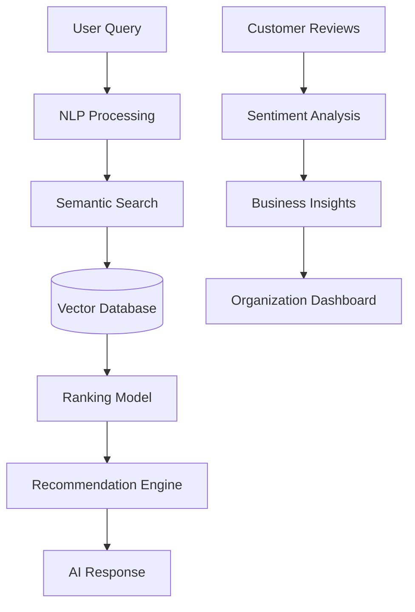
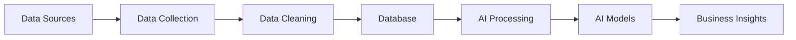
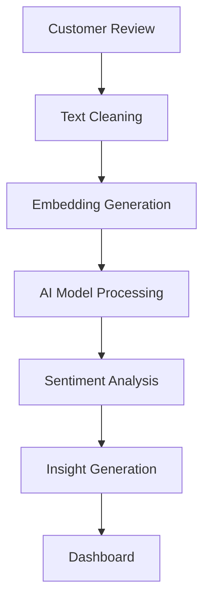

# AI Roadmap Document

Version: 1.0

---

# Table of Contents

1. AI Vision
2. AI Strategy
3. AI Architecture
4. AI Features
5. Data Strategy
6. AI Development Phases
7. Machine Learning Models
8. LLM Integration
9. AI Pipeline
10. AI Evaluation
11. Future AI Capabilities

---

# 1. AI Vision

The goal of AI in this platform is to transform a traditional business directory into an intelligent decision-making system.

The AI should help users answer:

"Which service provider is the best choice for my specific needs, and why?"

---

# 2. AI Strategy

The AI system will focus on:

- Understanding user intent
- Processing large amounts of reviews
- Finding hidden patterns
- Ranking organizations
- Providing personalized recommendations
- Helping businesses improve

---

# 3. AI Architecture


High-level AI architecture:




---

# 4. AI Features


# 4.1 AI Semantic Search


## Purpose

Allow users to search naturally.


Traditional:


```
hotel bole
```


AI Search:


```
Find a clean affordable hotel near Bole Airport with breakfast
```


AI understands:


- Location
- Budget
- Preferences
- Intent

---

## Technology


Initial:

- PostgreSQL search


Advanced:

- Embeddings
- Vector database
- LLM reranking

---

# 4.2 AI Recommendation Engine


## Purpose

Recommend the best providers for each user.


Inputs:


```
User preference

Location

Budget

Ratings

Reviews

Past behavior
```


Output:


```
Recommended organizations

+

Explanation
```


Example:


"Recommended because it has high customer satisfaction, affordable pricing, and positive reviews."

---

# 4.3 Review Sentiment Analysis


## Purpose

Understand customer opinions.


Input:


```
Customer review text
```


Output:


```
Positive

Negative

Neutral
```


Example:


Review:


"Excellent service but slow response."


AI:


Positive:

Service quality


Negative:

Response time

---

# 4.4 AI Review Summary


## Purpose

Convert hundreds of reviews into useful information.


Example:


Input:


```
500 reviews
```


Output:


```
Strengths:

- Friendly staff
- Good quality


Weaknesses:

- Expensive
- Long waiting time
```

---

# 4.5 AI Business Intelligence


## Purpose

Help organizations improve.


Example:


AI Insight:


"Customer satisfaction decreased 15% because customers mention delayed responses."

---

# 5. Data Strategy


AI depends on quality data.


Data sources:


## Internal Data


- Organization profiles
- Services
- Reviews
- User behavior


## External Data


- Public business information
- Partner data
- APIs


---

# Data Pipeline




---

# 6. AI Development Phases


# Phase 1: AI Foundation


Timeline:

MVP + 3 months


Features:


- Review summarization
- Basic sentiment analysis


Technology:


- LLM API
- NLP libraries


---

# Phase 2: Intelligent Search


Timeline:

3-6 months


Features:


- Semantic search
- Natural language queries


Technology:


- Embeddings
- Vector database


---

# Phase 3: Recommendation System


Timeline:

6-12 months


Features:


- Personalized ranking
- User preference learning


Technology:


- Machine learning models
- Ranking algorithms


---

# Phase 4: Advanced AI Platform


Timeline:

12+ months


Features:


- AI business advisor
- Market prediction
- Automated insights


---

# 7. Machine Learning Models


## Classification Models


Used for:


- Sentiment classification
- Review categories


Examples:


- Logistic Regression
- BERT
- Transformers


---

## Ranking Models


Used for:


- Organization ranking
- Recommendations


Examples:


- Learning to Rank
- Gradient Boosting


---

## Recommendation Models


Methods:


## Content-based


Uses:

- Service similarity
- Industry
- Features


---

## Collaborative Filtering


Uses:

- User behavior
- Similar users


---

# 8. LLM Integration


Possible models:


## Commercial APIs


Examples:


- OpenAI models
- Google Gemini
- Anthropic Claude


---

## Open Source Models


Examples:


- Llama
- Mistral


---

# LLM Uses


- Summarization
- Question answering
- Explanation generation
- AI assistant


---

# Prompt Management


Store prompts:


```
ai-engine/


prompts/


review_summary.txt

recommendation.txt

assistant.txt

```

---

# 9. AI Pipeline


Complete workflow:




---

# 10. AI Evaluation


AI quality must be measured.


Metrics:


## Search


- Search relevance
- Click-through rate


---

## Recommendation


- Accuracy
- Conversion rate


---

## Sentiment


- Precision
- Recall
- F1 Score


---

## AI Response


Evaluate:


- Correctness
- Helpfulness
- Safety

---

# 11. Future AI Capabilities


Future features:


## AI Service Advisor


User asks:


"Which software company should I choose?"


AI responds:


with recommendations and reasoning.

---

## Predictive Analytics


Predict:


- Customer satisfaction
- Market trends
- Business performance


---

## AI Agents


Automate:


- Data collection
- Business analysis
- Customer support

---

# Final AI Strategy


The AI evolution:


```
AI Assistant

↓

AI Search Engine

↓

AI Recommendation Engine

↓

AI Business Intelligence

↓

AI Decision Infrastructure
```

---

End of Document