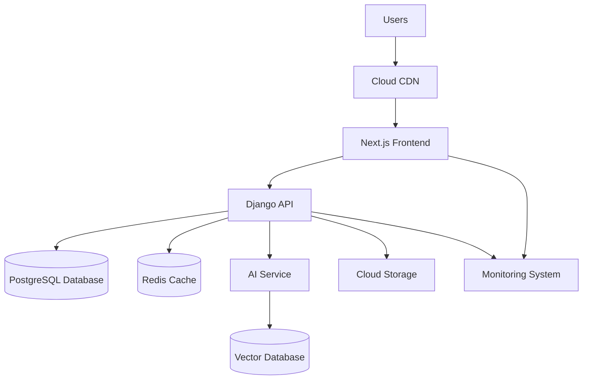
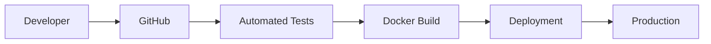

# Deployment Document

Version: 1.0

---

# Table of Contents

1. Deployment Goal
2. Environment Strategy
3. Infrastructure Architecture
4. Local Development Setup
5. Docker Architecture
6. Cloud Deployment
7. CI/CD Pipeline
8. Database Deployment
9. AI Service Deployment
10. Monitoring
11. Security
12. Backup Strategy
13. Scaling Strategy

---

# 1. Deployment Goal

Create a reliable deployment system that supports:

- Fast development
- Secure production
- Easy scaling
- Continuous improvement

The deployment strategy should support the evolution from MVP to enterprise platform.

---

# 2. Environment Strategy


The project uses three environments:


## Development


Purpose:

Daily coding and testing.


Example:


```
Developer Laptop

Docker

Local Database
```


---

## Staging


Purpose:

Pre-production testing.


Used for:

- Feature testing
- QA testing
- Client demos


---

## Production


Purpose:

Real users.


Requirements:

- High availability
- Monitoring
- Security

---

# 3. Infrastructure Architecture


Production architecture:




---

# 4. Local Development Setup


Required tools:


```
Git

Docker

Python

Node.js

PostgreSQL

VS Code
```


---

# Local Services


Using Docker:


```
docker-compose.yml
```


Services:


```
frontend

backend

database

redis

ai-engine
```

---

# 5. Docker Architecture


Example:


```
Project


├── frontend container

├── backend container

├── postgres container

├── redis container

└── ai container

```


---

# Docker Benefits


Provides:


- Same environment for all developers
- Easy deployment
- Isolation
- Scalability

---

# 6. Cloud Deployment


Recommended:


## Initial MVP


Cloud:


- AWS
- Google Cloud
- Azure


Recommended AWS:


```
Frontend:

AWS Amplify / CloudFront


Backend:

AWS ECS


Database:

Amazon RDS PostgreSQL


Storage:

Amazon S3


Cache:

ElastiCache Redis
```


---

# Future Enterprise


Architecture:


```
Kubernetes

+

Containers

+

Load Balancer

+

Auto Scaling
```

---

# 7. CI/CD Pipeline


Purpose:

Automatically test and deploy code.


Workflow:




---

# Pipeline Steps


## Step 1

Developer creates code.


---

## Step 2

Push to GitHub.


---

## Step 3

CI runs:


- Unit tests
- Security checks
- Code quality checks


---

## Step 4

Build Docker images.


---

## Step 5

Deploy automatically.

---

# 8. Database Deployment


Production database:


Technology:


```
PostgreSQL
```


Requirements:


- Automated backups
- Encryption
- Monitoring


---

# Database Migration


Process:


```
Developer

↓

Migration File

↓

Testing

↓

Production Database
```

---

# 9. AI Service Deployment


AI service runs separately.


Architecture:


```
Backend API

↓

AI API

↓

ML Models

↓

Vector Database
```


---

# AI Infrastructure


Initial:


```
FastAPI

Docker

Cloud VM
```


Future:


```
GPU Servers

Kubernetes

Model Serving Infrastructure
```

---

# 10. Monitoring


Monitor:


## Application


- API response time
- Errors
- Requests


---

## Database


- Query performance
- Connections
- Storage


---

## AI


- Model accuracy
- Response quality
- Token usage


---

# Monitoring Tools


Examples:


Application:


- Prometheus
- Grafana


Errors:


- Sentry


Cloud:


- AWS CloudWatch

---

# 11. Security


## Application Security


Implement:


- HTTPS
- Authentication
- Authorization
- Rate limiting


---

## Database Security


Implement:


- Encryption
- Access control
- Backup protection


---

## API Security


Implement:


- JWT tokens
- Input validation
- Request limits

---

# 12. Backup Strategy


Backup:


## Database


Daily automated backup.


---

## Files


Backup:


- Images
- Documents
- Business files


---

## Disaster Recovery


Maintain:


- Backup copies
- Recovery process
- Recovery testing

---

# 13. Scaling Strategy


## Stage 1: MVP


Architecture:


```
Single cloud deployment

+

Managed database
```


---

## Stage 2: Growth


Add:


```
Load Balancer

Multiple backend instances

Caching

Search engine
```


---

## Stage 3: Enterprise


Move to:


```
Kubernetes

Microservices

Distributed databases

Advanced AI infrastructure
```

---

# Final Deployment Strategy


Start simple:


```
Docker

+

Cloud Platform

+

Managed Database

+

CI/CD
```


Scale when needed:


```
Containers

+

Kubernetes

+

Distributed Architecture
```

---

End of Document