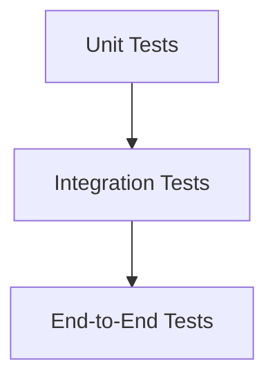
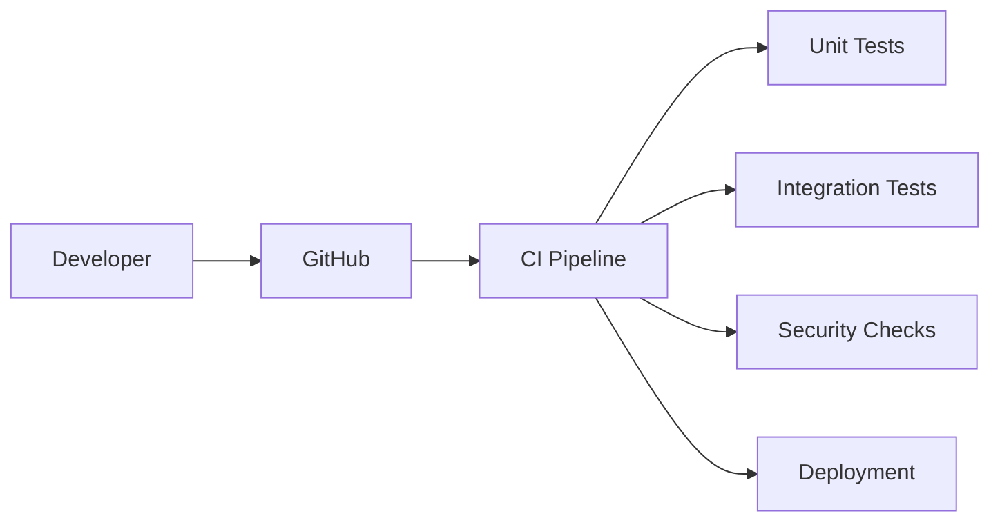

# Testing Strategy Document

Version: 1.0

---

# Table of Contents

1. Testing Goal
2. Testing Principles
3. Testing Levels
4. Backend Testing
5. Frontend Testing
6. API Testing
7. Database Testing
8. AI Testing
9. Security Testing
10. Performance Testing
11. Automated Testing Pipeline
12. Release Checklist

---

# 1. Testing Goal

The purpose of testing is to ensure the platform is:

- Reliable
- Secure
- Scalable
- Easy to maintain
- Providing accurate AI results

Testing must happen throughout development, not only before launch.

---

# 2. Testing Principles

## Test Early

Find problems before production.


---

## Automate Repetitive Testing

Automated tests should run on every code change.


---

## Test Business Logic

The most important parts of the system must have strong coverage.


---

## Quality Over Quantity

A few meaningful tests are better than many weak tests.

---

# 3. Testing Levels


The testing pyramid:




---

# 4. Backend Testing


Technology:


```
Python

Pytest

Django Test Framework
```


---

# Unit Testing


Purpose:

Test individual functions.


Example:


Testing:


```
calculate_rating_score()
```


Verify:


```
Correct score calculation
```

---

# Service Layer Testing


Test:


- Business rules
- Calculations
- Validation


Example:


```
Organization verification process
```

---

# Model Testing


Test:


- Database relationships
- Constraints
- Validation


Example:


```
Organization cannot exist without industry
```

---

# 5. Frontend Testing


Technology:


```
Jest

React Testing Library

Playwright
```


---

# Component Testing


Test:


- Buttons
- Forms
- Cards
- Search components


Example:


```
Login button submits correctly
```

---

# User Interface Testing


Verify:


- Pages load
- Forms work
- Navigation works

---

# 6. API Testing


Purpose:

Ensure backend communication works correctly.


Technology:


```
Postman

Pytest

OpenAPI Testing
```


---

# Test:


## Authentication API


Verify:


- User registration
- Login
- Token validation


---

## Organization API


Verify:


- Create organization
- Update profile
- Permission rules


---

## Review API


Verify:


- Create review
- Rating validation
- Fraud prevention

---

# 7. Database Testing


Test:


## Data Integrity


Example:


```
Review must belong to existing user
```


---

## Relationships


Example:


```
Organization

has many services
```


---

## Performance


Test:


- Query speed
- Large datasets
- Index usage

---

# 8. AI Testing


AI requires special testing because outputs are probabilistic.

---

# AI Feature Testing


## Semantic Search


Measure:


- Search relevance
- Result quality


Example:


User:


"Affordable hotel near airport"


Expected:


Relevant hotels appear.

---

# Recommendation Testing


Measure:


- Accuracy
- Click rate
- User satisfaction


---

# Sentiment Analysis Testing


Metrics:


## Precision


How many predicted results are correct.


---

## Recall


How many actual results are found.


---

## F1 Score


Balance between precision and recall.

---

# AI Safety Testing


Check:


- Hallucination
- Incorrect recommendations
- Bias
- Unsafe content


---

# AI Model Version Testing


Track:


```
Model Version

Input

Output

Performance
```

---

# 9. Security Testing


Purpose:

Protect users and businesses.

---

# Authentication Testing


Check:


- Password security
- Token expiration
- Unauthorized access


---

# Authorization Testing


Example:


Customer cannot access admin dashboard.

---

# Input Security


Test:


- SQL injection
- XSS attacks
- Invalid data


---

# API Security


Test:


- Rate limiting
- Permission checks
- Data exposure

---

# 10. Performance Testing


Purpose:

Ensure the system works under load.

---

# Load Testing


Test:


Example:


```
10,000 users searching at the same time
```

---

# Stress Testing


Find system limits.


Example:


Increase traffic until failure.

---

# Performance Metrics


Measure:


## Backend


- API response time
- Database queries


## Frontend


- Page loading speed


## AI


- Response time
- Processing cost

---

# 11. Automated Testing Pipeline


Testing workflow:




---

# CI Pipeline Checks


Every pull request:


Run:


```
Code formatting

Unit tests

API tests

Security checks

Build verification
```

---

# 12. Release Checklist


Before production release:


## Functionality


✓ All features work

✓ User flows tested

✓ Critical bugs fixed


---

## Security


✓ Authentication tested

✓ Permissions verified

✓ Sensitive data protected


---

## Performance


✓ Load testing completed

✓ Database optimized


---

## AI Quality


✓ Model evaluated

✓ Outputs reviewed

✓ Accuracy measured


---

## Documentation


✓ API documentation updated

✓ Architecture updated

✓ Deployment instructions updated

---

# Testing Coverage Goal


Target:


```
Critical backend logic:

80%+ coverage


Overall application:

70%+ coverage
```

---

# Final Testing Strategy


The platform follows:


```
Prevent Problems

↓

Detect Problems

↓

Fix Problems

↓

Improve Continuously
```

Quality is a continuous engineering process.

---

End of Document